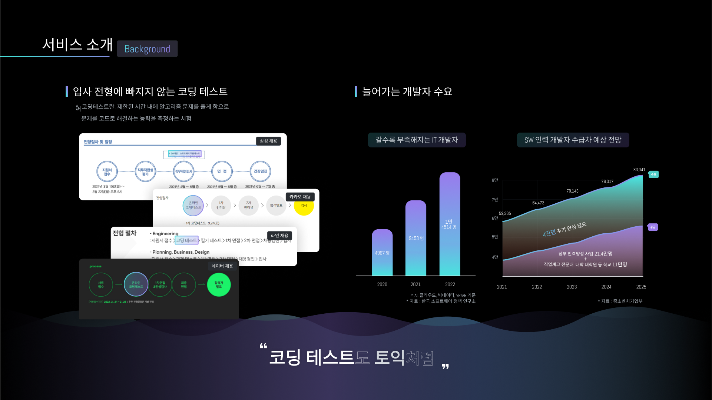
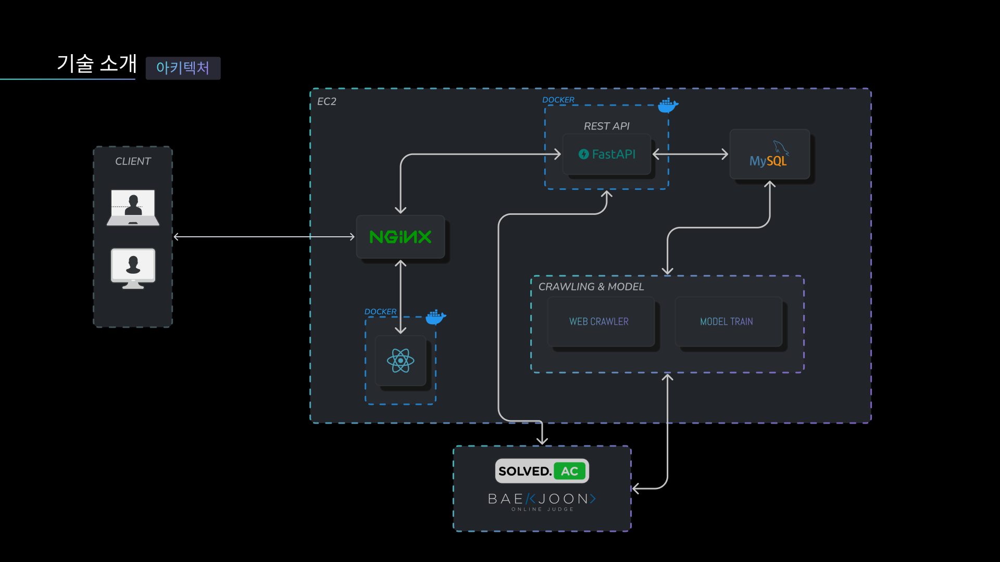
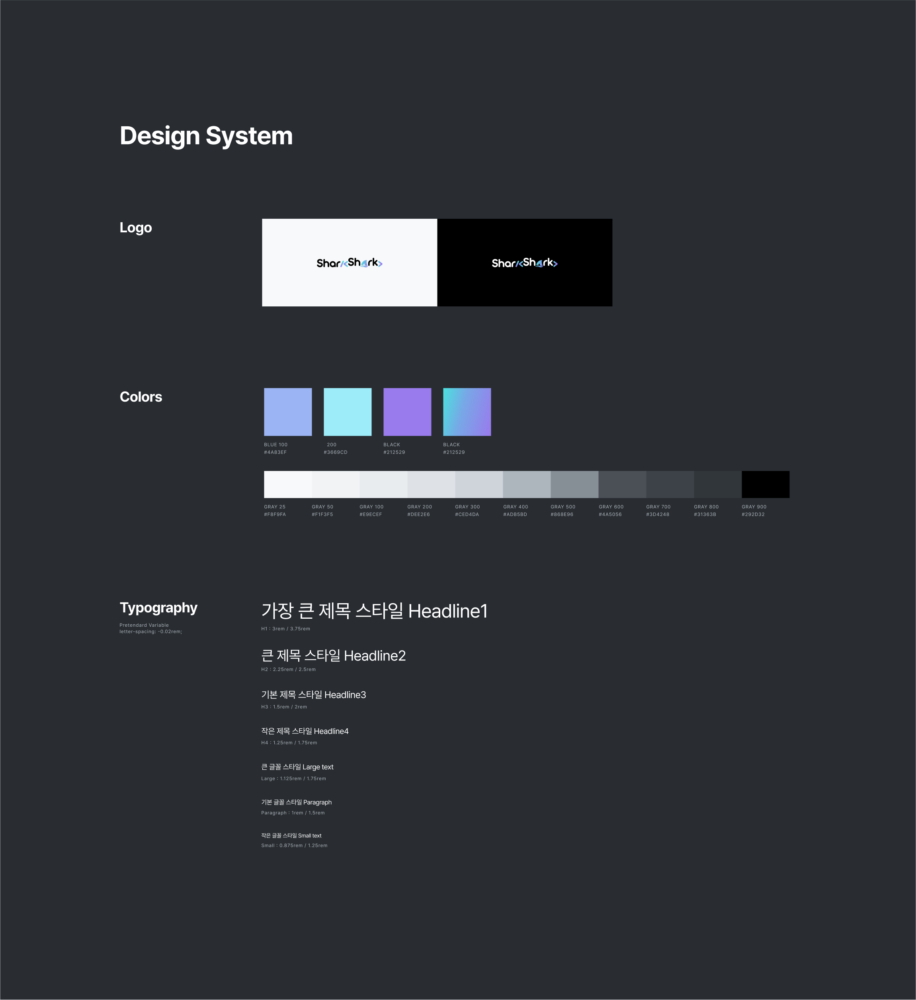
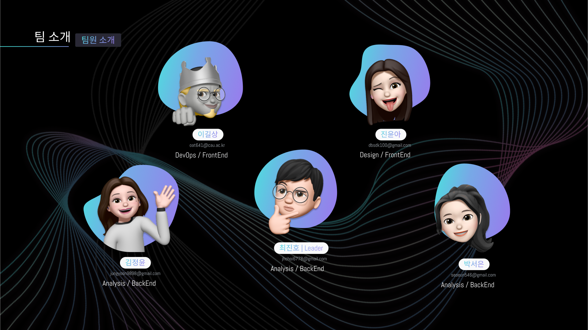

  
[TOC]


------------------------------------------

# 1.  소개

  
  ### **원하는 문제만 샥샥(SharkShark🦈🦈) 풀고 싶은 당신을 위한 코딩 문제 추천 서비스**
    
  🌊 Naming : 서비스의 상징인 상어와 문제를 샥샥(SharkShark) 푼다는 의미를 결합.
  
   늘어나는 개발자 수요에 따라 증가하는 코딩 테스트에 대비하여, 
  
  알고리즘 실력 향상, 실전 연습, 학습 동기 부여 등 원활한 코딩 문제 학습을 지원하는 서비스.
  

  

  

  

  


------------------------------------------------------
  
# 2. 개발 환경
  
## 2-1. 환경 설정
    
  ### **🧑‍💻 Front-end**
    
    - React 18.2.0

    - Node 16.17

    - npm 8.15.0

    - ChakraUI 2.3.2

  ### **👨‍💻 Back-end**
    
    - Python 3.9
      
    - Pycharm, Google Colab

    - Fast API

    - MySQL

    ※ [설치 파일](./back/pythonProject/requirements.txt/)
    
  ### **👩‍💻 CI/CD**  
    
    - AWS EC2
      
    - Jenkins
      
    - Docker 20.10.18
      
    - Docker-compose
      
  

## 2-2. 서비스 아키텍처
  

  
------------------------------------------------------
  

# 3. 배포 문서
  
## 📋 배포 가이드
  
1. **git clone**
  
  ```bash
  git clone https://lab.ssafy.com/s07-bigdata-recom-sub2/S07P22B205.git
  ```
    
2. **[도커 설치](https://docs.docker.com/get-docker/) 및 도커 [컴포즈 설치](https://docs.docker.com/compose/install/)**
  
3. **EC2 서버 Nginx 설정 및 ssl 인증서 발급, 적용**
  
   - Nginx 다운로드

     ~~~bash
     # 설치
     sudo apt-get install nginx
     
     # 버전 확인
     nginx -v
     ~~~

   - letsencrypt 설치

     ~~~bash
     sudo apt-get install letsencrypt
     sudo systemctl stop nginx
     sudo letsencrypt certonly --standalone -d i7b205.p.ssafy.io
     ~~~

   - Nginx 포트 포워딩 및 기타 설정하기

     ~~~bash
     # 설정 파일이 위치할 디렉토리로 이동
     cd /etc/nginx/sites-available
     
     # 설정 파일 만들기
     sudo vi sowlmatessl.txt
     ~~~

     ~~~bash
     # 설정 파일
     server {
     
             location /{
                     proxy_pass http://localhost:3000;
     
                     proxy_buffer_size	128k;
                     proxy_buffers		4 256k;
                     proxy_busy_buffers_size	256k;
     
                     fastcgi_buffering	on;
                     fastcgi_buffer_size	16k;
                     fastcgi_buffers		16 16k;
     
                     fastcgi_connect_timeout	600s;
                     fastcgi_send_timeout	600s;
                     fastcgi_read_timeout	600s;
             }
     
             location /api/v1 {
                     proxy_pass https://localhost:8080/api/v1;
             }
     
     	location /meet {
                     proxy_pass https://localhost:8443/meet;
             }
     
         listen 443 ssl; # managed by Certbot
         ssl_certificate /etc/letsencrypt/live/i7b308.p.ssafy.io/fullchain.pem; # managed by Certbot
         ssl_certificate_key /etc/letsencrypt/live/i7b308.p.ssafy.io/privkey.pem; # managed by Certbot
         # include /etc/letsencrypt/options-ssl-nginx.conf; # managed by Certbot
         # ssl_dhparam /etc/letsencrypt/ssl-dhparams.pem; # managed by Certbot
     }
     
     server {
         if ($host = i7b308.p.ssafy.io) {
             return 301 https://$host$request_uri;
         } # managed by Certbot
     
             listen 80;
             server_name i7b308.p.ssafy.io;
         return 404; # managed by Certbot
     }
     ~~~

   - Nginx에 설정 적용하기

     ~~~bash
     sudo ln -s /etc/nginx/sites-available/sowlmatessl.txt /etc/nginx/sites-enabled/sowlmatessl.txt
     
     sudo nginx -t
     
     sudo systemctl restart nginx
     ~~~

4. **EC2에 도커 이미지를 통한 MySQL 설치 및 설정**

   - 도커 이미지 받기

     ~~~bash
     docker pull mysql
     ~~~

   - mysql 이미지 실행하기

     ~~~bash
     docker run --name sowlmate-db -e MYSQL_ROOT_PASSWORD=<YOUR_PASSWORD> -d -p 3306:3306 mysql:latest
     ~~~

   - mysql 컨테이너 접속하기

     ~~~bash
     docker exec -it sowlmate-db bash
     
     # mysql의 bash
     show databases;
     ~~~

   - mysql 설정하기

     ~~~bash
     # sowlmate DB 생성
     CREATE DATABASE sowlmate;
     
     # 사용자 생성
     CREATE USER '{username}'@'localhost' IDENTIFIED BY '{password}';
     CREATE USER '{username}'@'%' IDENTIFIED BY '{password}';
     
     # 권한 부여
     GRANT ALL PRIVILEGES ON {database}.* TO '{username}'@'localhost';
     FLUSH PRIVILEGES;
     ~~~

5. **EC2 젠킨스 설정**

   - 젠킨스 도커 이미지 가져오기

     ~~~bash
     docker pull jenkins/jenkins
     ~~~

   - 도커 이미지 실행

     ~~~bash
     docker run -u root --rm -d -p 9090:8080 --name jenkins -v /jenkins:/var/jenkins_home -v /var/run/docker.sock:/var/run/docker.sock -v /usr/local/bin/docker-compose:/usr/bin/docker-compose jenkins/jenkins:lts
     ~~~

   - 이후 '<도메인>:9090' 에 접속해 젠킨스 설정을 진행한다.

     - Git, Gitlab 관련 모든 플러그인 설치
     - Docker 관련 모든 플러그인 설치
     - Dashboard/Jenkins 관리/Manage Credentials 에서 Gitlab 유저 정보를 설정한다.
     - 프로젝트 내에서 Jenkinsfile을 만들어 사용했으므로 이에 맞게 설정한다.
     - 깃랩 webhook 브랜치는 master로 설정했다.

   - Jenkinsfile

     ~~~
     pipeline {
     	environment {
     		registry = "sowlmate308/sowlmate"
     		registryCredential = 'docker-credentials'
     		dockerImage = ''
     		PATH = "$PATH:/usr/local/bin"
     	}
     	agent any
     	stages {
     		stage('Build image') {
     			steps {
     				echo "$PATH"
     				sh 'docker-compose build'
     				// sh 'docker image tag $registry:$BUILD_NUMBER $registry:latest'
     				echo 'Build image...'
     			}
     		}
     		// stage('Test image') {
     		// 	steps {
     		// 		sh 'docker run -d -p 80:80 --name apm $registry:$BUILD_NUMBER'
     		// 		echo 'Test image...'
     		// 	}
     		// }
     		stage('Push image') {
     			steps {
     				sh 'docker push sowlmate308/sowlmate:back'
     				sh 'docker push sowlmate308/sowlmate:front'
     				sh 'docker push sowlmate308/sowlmate:kurento'
     				echo 'Push image...'
     				// withDockerRegistry([ credentialsId: registryCredential, url: "https://hub.docker.com/repository/docker/sowlmate308/sowlmate" ]) {
     				// 	sh 'docker push sowlmate308/sowlmate:back'
     				// 	sh 'docker push sowlmate308/sowlmate:front'
     				// }
     				// echo 'Push image...'
     			}
     		}
     		stage('Clean image') {
     			steps {
     				sh 'docker rm -f `docker ps -aq --filter="name=sowlmate-front"`'
     				sh 'docker rm -f `docker ps -aq --filter="name=sowlmate-back"`'
     				sh 'docker rm -f `docker ps -aq --filter="name=sowlmate-kurento"`'
     				sh 'docker rmi $registry:back'
     				sh 'docker rmi $registry:front'
     				sh 'docker rmi $registry:kurento'
     				echo 'Clean image...'
     			}
     		}
     		stage('Deploy image') {
     			steps {
     				sh 'docker run -d -p 8080:8080 --name sowlmate-back --restart always sowlmate308/sowlmate:back'
     				sh 'docker run -d -p 3000:80 --name sowlmate-front --restart always sowlmate308/sowlmate:front'
     				sh 'docker run -d -p 8443:8443 --name sowlmate-kurento --restart always sowlmate308/sowlmate:kurento'
     				echo 'Deploy image...'
     			}
     		}
     	}
     }
     ~~~

     - 이미지를 빌드, 도커 허브에 푸쉬, 기존 사용 컨테이너 중단 및 이미지 삭제, 새로 배포되는 구조를 가진다.

   - 젠킨스에서 도커, 도커 컴포즈, 도커 허브 사용하기

     ~~~bash
     # 젠킨스 컨테이너에 접속
     docker exec -it -u root jenkins bash
     
     # 도커 볼륨 사용 권한 획득
     chown jenkins:jenkins /var/run/docker.sock
     
     # https://www.hostwinds.kr/tutorials/install-docker-debian-based-operating-system
     # 위 링크를 참고해 도커를 설치
     apt-get update
     
     apt-get install \
     apt-transport-https \
     ca-certificates \
     curl \
     gnupg2 \
     software-properties-common
     
     curl -fsSL https://download.docker.com/linux/debian/gpg | sudo apt-key add -
     
     apt-key fingerprint 0EBFCD88
     
     add-apt-repository \
     "deb [arch=amd64] https://download.docker.com/linux/debian \
     $(lsb_release -cs) \
     stable"
     
     apt-get update
     
     apt-get install docker-ce docker-ce-cli containerd.io
     
     # 도커 컴포즈 설치
     curl -L <https://github.com/docker/compose/releases/download/{설치버전}/docker-compose-`uname> -s`-`uname -m` -o /usr/local/bin/docker-compose
     
     docker-compose -v
     
     # 도커 허브 로그인
     docker login
     ~~~

6. **Kurento Media Server 도커 설정**

   ~~~bash
   # coturn 설정
   sudo apt install coturn
   
   sudo vi /etc/turnserver.conf
   
   # turnserver.conf 파일 내에 아래 설정 붙여넣기
   external-ip=3.38.245.51/172.26.10.188 listening-port=3478 listening-ip=172.26.10.188 relay-ip=172.26.10.188 fingerpring lt-cred-mech max-port=65535 min-port=40000 pidfile="/var/run/turnserver.pid" user=myuser:mypassword realm=openvidu simple-log redis-userdb="ip=127.0.0.1 dbname=0 password=turn connect_timeout=30" verbose
   
   # coturn 서버 재시작
   sudo service coturn restart
   ~~~

   ~~~bash
   docker run --rm -d --name kms -p 8888:8888/tcp \
   -p 5000-5050:5000-5050/udp \
   -e KMS_MIN_PORT=5000 \
   -e KMS_MAX_PORT=5050 \
   -e GST_DEBUG="Kurento*:5" \
   -e KMS_STUN_IP=3.38.245.51 \
   -e KMS_STUN_PORT=3478 \
   -e KMS_TURN_URL=myuser:mypassword@3.38.245.51:3478?transport=udp kurento/kurento-media-server:latest
   ~~~

7. **서버에 올리고 싶은 내용을 master 브랜치에 MR을 날려 동작을 확인한다.**

   - docker-compose.yml

     ~~~
     version: "3"
     
     services:
       back:
         build:
           context: ./sowlmate
           dockerfile: Dockerfile
           # target: finalApp
         image: sowlmate308/sowlmate:back
         container_name: sowlmate-back
         restart: always
         ports:
           - 8080:8080
     
       kurento:
         build: ./kurento
         image: sowlmate308/sowlmate:kurento
         container_name: sowlmate-kurento
         restart: always
         ports:
           - 8443:8443
         depends_on:
           - back
     
       front:
         build: ./front
         image: sowlmate308/sowlmate:front
         container_name: sowlmate-front
         restart: always
         ports:
           - 80:80
         depends_on:
           - kurento
     ~~~

   - Dockerfile

     ~~~
     # 프론트
     FROM node:16.16.0-alpine
     WORKDIR /app
     COPY package*.json ./
     RUN npm install
     COPY . .
     RUN npm run build
     EXPOSE 80
     CMD [ "npm", "run", "serve" ]
     
     # 백
     FROM openjdk:8-jdk-alpine AS builder
     WORKDIR /backend
     COPY . .
     RUN chmod +x ./gradlew
     
     RUN ./gradlew clean build
     RUN ls build/libs
     
     FROM openjdk:8-jdk-alpine
     COPY --from=builder /backend/build/libs/*.jar app.jar
     
     EXPOSE 8080
     ENTRYPOINT ["java", "-jar", "-Duser.timezone=Asia/Seoul", "./app.jar"]
     
     # 쿠렌토 노드
     FROM node
     WORKDIR /app
     COPY package*.json ./
     COPY . .
     RUN npm install
     COPY . .
     EXPOSE 8443
     CMD [ "npm", "start", "--", "--ws_uri=ws://i7b308.p.ssafy.io:8888/kurento" ]
     ~~~


--------------------------

  
  

# 4. 주요 기능
------------------------------------------------------
  

--------------------------


# 5. 배포
------------------------------------------------------
  - Dokcer와 Jenkins를 이용한 배포, 배포 시 3분 가량의 서버 중단이 생김
  
  
--------------------------
  
  

# 6. 📁 설계 문서
------------------------------------------------------
    
  ## 6-1. ERD

    


  ## 6-2. Design System

  


  ## 6-3. Design

    
  

--------------------------


# 7. 협업
------------------------------------------------------
  
  ## 7-1. Git Commit Convention

  ```markdown
  - `Feat` : 새로운 기능을 추가할 경우
  - `Fix` : 버그를 고친 경우
  - `Docs` : 문서를 수정한 경우
  - `Design` : CSS 등 사용자 UI 디자인 변경
  - `Style` : 코드 포맷 변경, 세미 콜론 누락, 코드 수정이 없는 경우
  - `Refac` : 프로덕션 코드 리팩토링 (코드 최적화)
  - `Test` : 테스트 추가, 테스트 리팩토링(프로덕션 코드 변경 X)
  - `Build` : 빌드 관련 파일 수정
  - `Rename` : 파일 혹은 폴더명을 수정하거나 옮기는 작업만인 경우
  - `Merge` : PR을 요청하는 경우
  - `Perf` : 성능 개선
  - `Chore` : 패키지 매니저 등 그 외 자잘한 수정
  ```

  - 제목 끝에 마침표 금지, 명령문, 현재 시제로 작성, 대문자 사용 금지

    ex) Feat : add login validation function

  -  Merge Commit

    ```tex
    Merge : #4 from sowl/branch_name
    ```

  ## 7-2. Git Branch

    ```markdown
    - master : deploy branch ===>>> release branch
    - dev : develop branch  ====>>> default branch
    - feat-fe-contents : frontend feature branch

    ex) `feat-fe-loginView`
    ex) `feat-be-contents` : backend feature branch

    ex) `fix-fe-contents` : frontend fix branch
    ex)`fix-be-contents` : backend fix branch

    ex)`refactor-fe-contents` : frontend refactoring branch
    ex)`refactor-be-contents` : backend refactoring branch
    ```
    
  ## 7-3. Jira

  ## 7-4. Notion

--------------------------


# 8. 👨‍👩‍👧‍👦  팀원 소개
------------------------------------------------------
  
  


