  
[TOC]


------------------------------------------

# 1.  소개

  
  ### **원하는 문제만 샥샥(SharkShark🦈🦈) 풀고 싶은 당신을 위한 코딩 문제 추천 서비스**
    
  🌊 Naming : 서비스의 상징인 상어와 문제를 샥샥(SharkShark) 푼다는 의미를 결합.
  
   늘어나는 개발자 수요에 따라 증가하는 코딩 테스트에 대비하여, 
  
  알고리즘 실력 향상, 실전 연습, 학습 동기 부여 등 원활한 코딩 문제 학습을 지원하는 서비스.
  

  

  

  

  


------------------------------------------------------
  
# 2. 🔍 개발 환경
  
## 2-1. 환경 설정
    
  ### **👨‍💻 Front-end**
    
    - React 18.2.0

    - Node 16.17

    - npm 8.15.0

    - ChakraUI 2.3.2

  ### **👨‍💻 Back-end**
    
    - Python 3.9
      
    - Pycharm, Google Colab

    - Fast API

    - MySQL

    ※ [설치 파일](./back/pythonProject/requirements.txt/)
    
  ### **👩‍💻 CI/CD**  
    
    - AWS EC2
      
    - Jenkins
      
    - Docker 20.10.18
      
    - Docker-compose
      
  

## 2-2. 서비스 아키텍처
  

  
------------------------------------------------------
  

# 3. 📘 실행 방법
  
## docker를 활용한 실행 가이드
  
1. **git clone**
  
  ```bash
  git clone https://lab.ssafy.com/s07-bigdata-recom-sub2/S07P22B205.git
  ```
    
2. **[도커 설치](https://docs.docker.com/get-docker/) 및 도커 [컴포즈 설치](https://docs.docker.com/compose/install/)**
  
3. **Dockerfile 및 docker-compose.yml작성**
  
   - nginx Dockerfile
     ~~~docker
      FROM node:16.17.0 as builder
      # 작업 폴더로 소스 파일 복사
      COPY {git 폴더}/front/sharkshark /home/react
      WORKDIR /home/react
      # node 패키지 설치 후 빌드
      RUN npm install
      RUN npm run build

      FROM nginx
      # nginx 설정 복사
      COPY {nginx.conf 위치} /etc/nginx
      # 빌드 파일 복사
      COPY --from=builder /home/react/build /home/build
      # 포트 개방
      EXPOSE 80
      CMD ["nginx", "-g", "daemon off;"]
     ~~~

   - fastapi dockerfile
     ~~~docker
      FROM python:3.9
      # 작업 폴더로 실행 폴더 복사
      WORKDIR /code
      COPY {git 폴더}/back/pythonProject /code
      # 파이썬 패키지 설치 후 실행
      RUN pip install --no-cache-dir --upgrade -r /code/requirements.txt
      CMD ["uvicorn", "main:app", "--host", "0.0.0.0", "--port", "8000"]
     ~~~

   - nginx.conf 파일
     ~~~bash
      user nginx;
      worker_processes auto;
      events {
        worker_connections 1024;
      }
      http{
        include mime.types;
        access_log /var/log/nginx/access.log;
        error_log /var/log/nginx/error.log;
        
        server {
          // 포트 지정
          listen 80;
          listen [::]:80;
          
          // 프론트 빌드파일 경로설정
          location / {
            root	/home/build;
            index	index.html index.htm;
            try_files 	$uri $uri/ /index.html;
          }
          // 백엔드 api 요청 포워딩
          location /api/{
            proxy_pass http://172.17.0.1:8000/;
          }
        }
      }
     ~~~

   - docker-compose.yml

     ~~~yml
      version: '3'
      services:
        nginx:
          build:
            context: .
            dockerfile: {nginx dockerfile 이름}
          ports:
            - 80:80
        api:
          build:
            context: .
            dockerfile: {fastapi dockerfile 이름}
          ports:
            - 8000:8000
          extra_hosts:
            - "localhost:host-gateway"

     ~~~

4. **도커 컨테이너 실행**
   - mysql 이미지 실행하기

     ~~~bash
      # mysql 이미지 가져오기
      docker pull mysql

      # 컨테이너 실행
      docker run --name mysql -e MYSQL_ROOT_PASSWORD={password} -d -p 3306:3306 mysql
     ~~~
  
   - 3306포트로 mySQL 접속하여 b205 스키마 생성

   - docker-compose 실행

     ~~~bash
     docker compose up -d --build
     # 혹은
     docker-compose up -d --build
     ~~~


5. **작동 확인**

  - 실행 중인 컨테이너 조회

     ~~~bash
     docker ps
     ~~~
    
  - mySQL 접속하여 DB [덤프 파일](/exec/sharkshark_dp_dump.zip) 실행

--------------------------

  
  

# 4. 🦈 주요 기능
------------------------------------------------------
  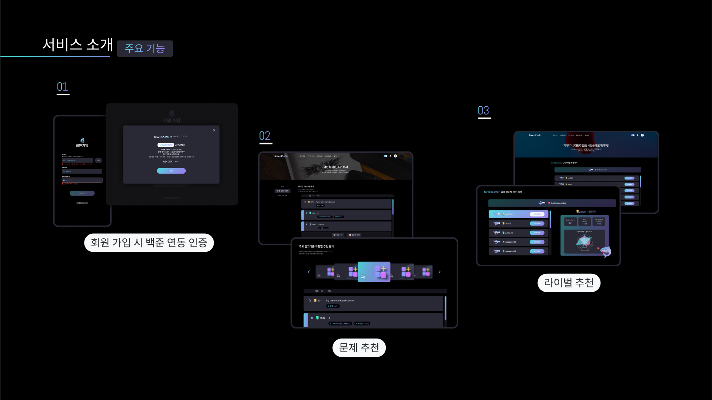
  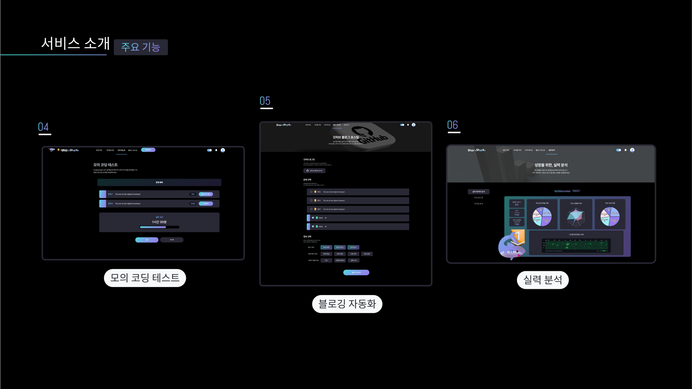

  1. 회원 가입 시, 백준 연동 인증

    

  2. 문제 추천

    - 추천 문제 : user와 비슷한 실력을 가진 사용자 기반하여 추천

    - 사용자 기반 추천 문제 : user의 라이벌 기반 추천 문제, 라이벌이 푼 문제 중 user가 풀지 않은 문제 추천

    - 유형별 추천 문제 : 주요 알고리즘 유형별(총 8유형) 추천 문제

      - 주요 알고리즘 유형 : math, implementation, greedy, string, data structures, graphs,dp, bruteforce

  
  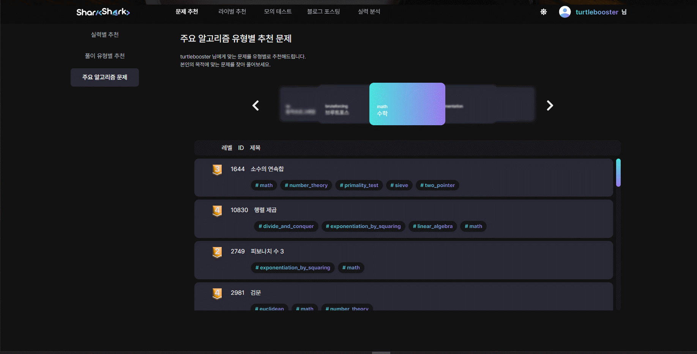

  3. 라이벌 추천

    - 라이벌 추천 목록 : user와 비슷하거나 조금 상위에 있는 라이벌을 추천

      - 라이벌 등록 전, 추천 라이벌과 user의 실력 분석 기능

    - 라이벌 관리 : 라이벌 등록/해지
  
  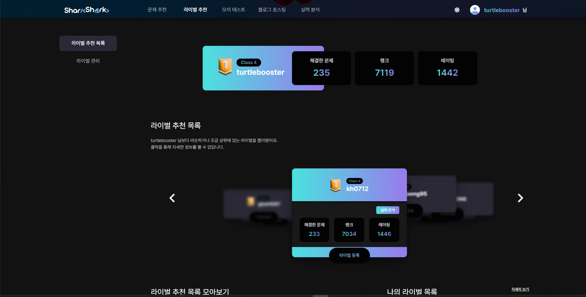
  


  4. 모의 코딩 테스트

    - 문제 : 추천 문제 리스트 중에서 추천

    - 코딩 테스트 시간 선정 기준 : 추천된 문제들의 level의 평균(문제 난이도)을 고려

    - 문제 제출 : BOJ에서 문제 제출 여부 확인

    - 테스트 종료 후, 제출한 문제들에 대한 실력 분석 제공


  5. 블로깅 자동화

    - 블로그 계정 설정 : Github 계정과 연결, 업로드할 Github repository 선택

    - Github 블로그 포스팅
  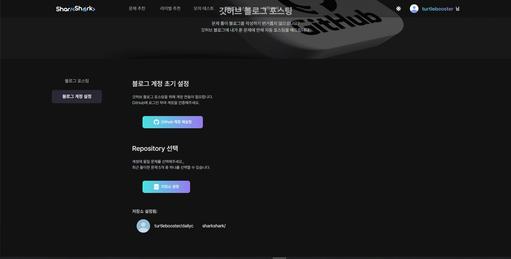
  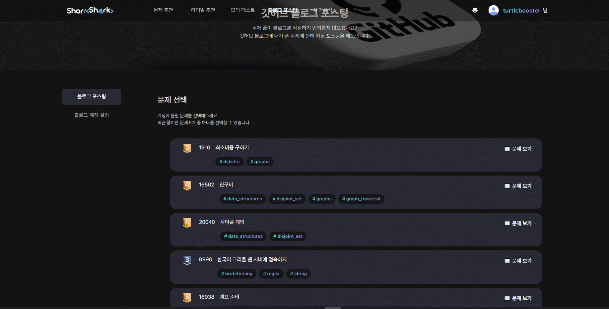
  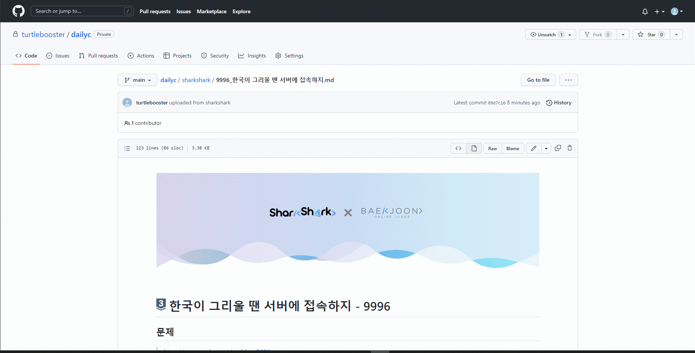

  6. 실력 분석

    - 알고리즘 실력 분석

    - 티어 로드맵

    - 유사 사용자 분석

  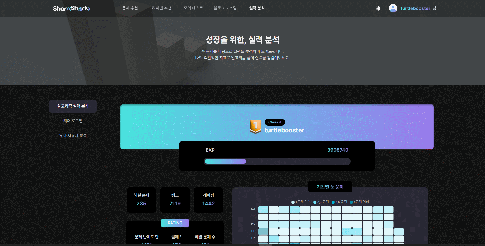
  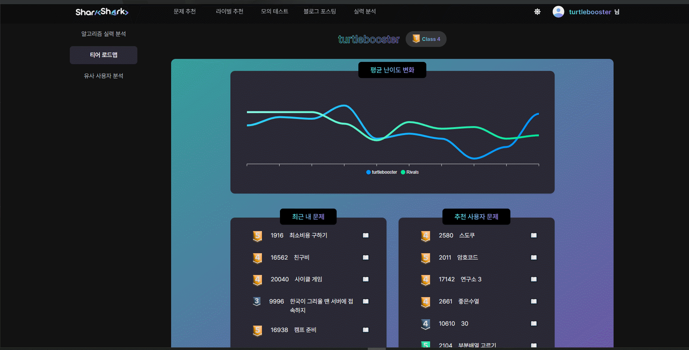
  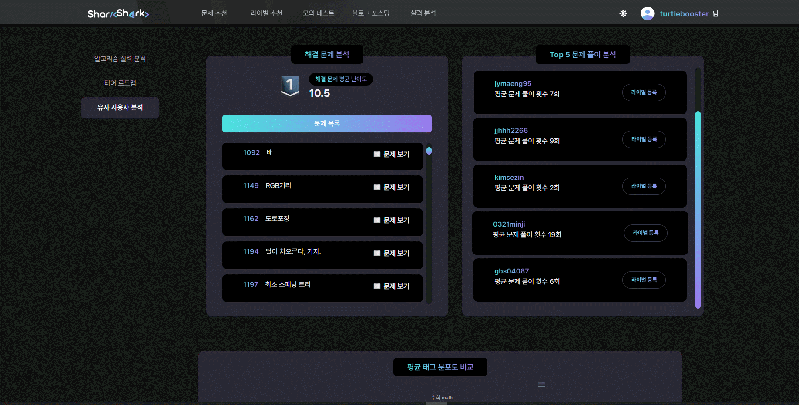


--------------------------


# 5. 🔍 추천 알고리즘
------------------------------------------------------
  - 라이벌 추천
    - KNN 알고리즘으로 라이벌 추천

  - 문제 추천
    - Matrix Factorization - ALS(Alternating Least Square) 알고리즘으로 라이벌 기반 문제 추천
  
--------------------------


# 6. 🛡 배포
------------------------------------------------------
  - https
    - certbot 컨테이너를 함께 실행
    - letsencrypt ssl 인증서 발급
    - EC2 제공 도메인 'http://j7b205.p.ssafy.io/' 사용하여 인증
  - 자동 배포
    - Gitlab에서 web hook 설정을 통해 jenkins 빌드 유발
    - jenkins의 shell script 실행 기능을 이용하여 git pull, docker compose up 커맨드 실행
  
  
--------------------------
  
  

# 7. 📁 설계 문서
------------------------------------------------------
    
  ## 6-1. ERD

  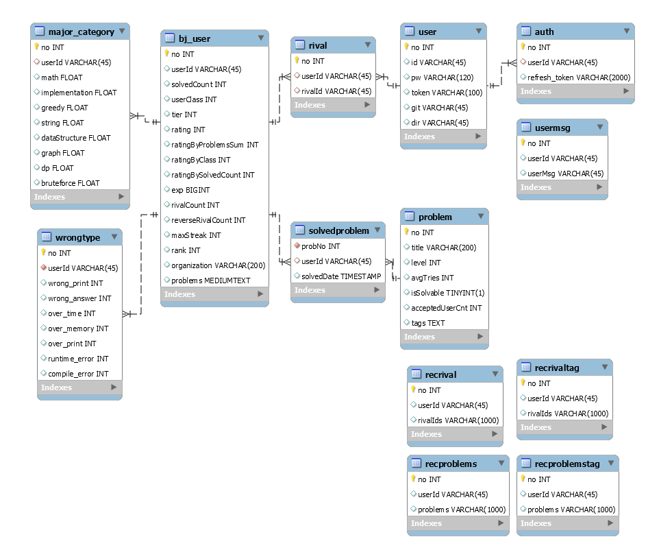


  ## 6-2. Design System

  


  ## 6-3. Design

    
  

--------------------------


# 8. 🖊 Cooperation&Promises
------------------------------------------------------
  
  ## 7-1. Tools

    - Git

    - Jira

    - Notion

    - Mattermost

    - Webex
      
      
  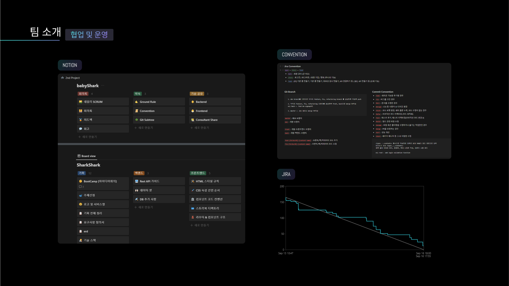
    
--------------------------


# 8. 👨‍👩‍👧‍👦  팀원 소개
------------------------------------------------------
  
  


